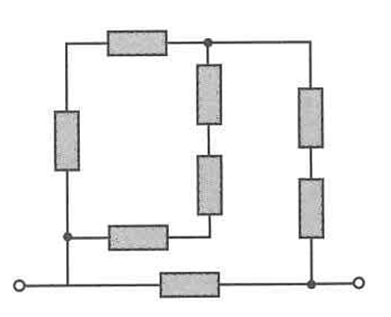

## 3. Mixed Circuit

Calculate the equivalent resistance for the circuit shown in the figure. All resistors have a resistance of $5\ \Omega$.

---

## Variables and Units

| Symbol | Stands For | Unit of Measurement | Description |
| --- | --- | --- | --- |
| **$R$** | Resistance | Ohms (Ω) | How much an individual component resists the flow of current. |
| **$R_s$** | Series Resistance | Ohms (Ω) | The combined resistance of components connected end-to-end. |
| **$R_p$** | Parallel Resistance | Ohms (Ω) | The combined resistance of components connected across the same two nodes. |
| **$R_{eq}$** | Equivalent Resistance | Ohms (Ω) | The final, total resistance of the entire circuit network. |

---

## Circuit Topology Breakdown

At first glance, this diagram looks complex. To solve it, we must carefully trace the nodes (the distinct connection points, indicated by the black dots) and count the rectangular resistor symbols to identify the parallel and series branches.

Let's identify the three main connection nodes:

* **Node 1 (Input):** The dot at the bottom left.
* **Node 2 (Output):** The dot at the bottom right.
* **Node 3 (Top Junction):** The dot at the top center/right.

Now, let's break down the branches between these nodes. There are 8 resistors in total, each measuring 5 Ω:

1. **Left-to-Top Branch (Node 1 to Node 3):** Goes up through one vertical resistor, turns right, and goes through one horizontal resistor. (2 resistors total).
2. **Middle-to-Inner Branch (Node 3 back to Node 1):** Goes down from the top dot through *two* vertical resistors, turns left, and goes through one inner horizontal resistor back to the first dot. (3 resistors total).
3. **Right Branch (Node 3 to Node 2):** Goes right from the top dot, then down through *two* vertical resistors to the output dot. (2 resistors total).
4. **Bottom Branch (Node 1 to Node 2):** Connects the input directly to the output via one horizontal resistor. (1 resistor total).

---

## Step-by-Step Solution

### Step 1: Calculate the Series Branches

For resistors in series, simply add their values ($R_s = R_1 + R_2 + ...$). Since every resistor is 5 Ω:

* **Left-to-Top Branch ($R_{s1}$):** 
$$R_{s1} = 5 + 5 = 10 \text{ Ω}$$

* **Middle-to-Inner Branch ($R_{s2}$):** 
$$R_{s2} = 5 + 5 + 5 = 15 \text{ Ω}$$

* **Right Branch ($R_{s3}$):** 
$$R_{s3} = 5 + 5 = 10 \text{ Ω}$$

### Step 2: Calculate the Parallel Section (Node 1 to Node 3)

The Left-to-Top branch ($R_{s1}$) and the Middle-to-Inner branch ($R_{s2}$) both start at Node 1 and end at Node 3. Therefore, they are in parallel with each other.

Use the parallel formula to find their equivalent resistance ($R_p$):

$$R_p = \frac{R_{s1} \times R_{s2}}{R_{s1} + R_{s2}}$$

$$R_p = \frac{10 \times 15}{10 + 15}$$

$$R_p = \frac{150}{25}$$

$$R_p = 6 \text{ Ω}$$

*The entire left and middle section of the circuit can be treated as a single 6 Ω resistor.*

### Step 3: Calculate the Total Upper Network Resistance

This new equivalent 6 Ω section is connected in series with the Right Branch ($R_{s3}$), which carries the current the rest of the way to Node 2.

$$R_{upper} = R_p + R_{s3}$$

$$R_{upper} = 6 + 10$$

$$R_{upper} = 16 \text{ Ω}$$

### Step 4: Calculate Final Equivalent Resistance ($R_{eq}$)

Finally, this entire upper network ($16 \text{ Ω}$) is in parallel with the single bottom horizontal resistor, which connects Node 1 directly to Node 2.

$$R_{eq} = \frac{R_{upper} \times R_{bottom}}{R_{upper} + R_{bottom}}$$

$$R_{eq} = \frac{16 \times 5}{16 + 5}$$

$$R_{eq} = \frac{80}{21}$$

$$R_{eq} \approx 3.81 \text{ Ω}$$

**Final Answer:** The equivalent resistance for this mixed circuit is exactly **80/21 Ω**, or approximately **3.81 Ω**.
