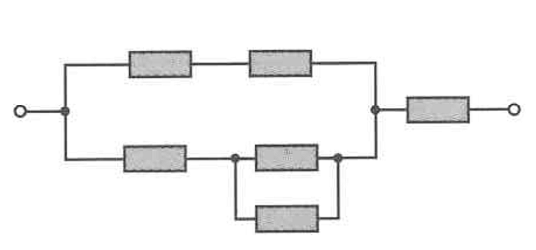

## 4. Mixed Circuit

Calculate the equivalent resistance for the circuit shown in the figure. All resistors have a resistance of $10\ \Omega$.

---

### Terminology & Units

* **$R$**: Stands for **Resistance**, which is the measure of opposition to current flow in an electrical circuit.
* **$\Omega$ (Ohm)**: The standard unit of measurement for resistance.
* **$R_{eq}$**: Stands for **Equivalent Resistance**. This is the total, combined resistance of the entire circuit (or a specific portion of it) if you were to replace all the individual resistors with a single resistor that has the exact same effect.
* **Series Circuit Rule**: Resistors placed end-to-end add together: $R_{series} = R_1 + R_2 + \dots$
* **Parallel Circuit Rule**: Resistors placed across multiple branches use the reciprocal formula: $\frac{1}{R_{parallel}} = \frac{1}{R_1} + \frac{1}{R_2} + \dots$ (For just two resistors, a shortcut is $R_{parallel} = \frac{R_1 \times R_2}{R_1 + R_2}$).

---

### Circuit Breakdown & Labeling

To solve this, let's assign a label to each of the 6 resistors in the diagram, reading from left to right. We are given that every resistor is $10\ \Omega$.

1. **Top Branch:** Contains two resistors in series. Let's call them **$R_1$** and **$R_2$**.
2. **Bottom Branch:** Contains one resistor (**$R_3$**) in series with a smaller parallel section made of two resistors (**$R_4$** and **$R_5$**).
3. **Final Series Resistor:** After the top and bottom branches merge, the circuit flows through one last resistor (**$R_6$**) before exiting.

---

### Step-by-Step Solution

**Step 1: Simplify the inner parallel pair in the bottom branch ($R_4$ and $R_5$)**
These two resistors are in parallel with each other. We use the parallel shortcut formula:

$$R_{4,5} = \frac{R_4 \times R_5}{R_4 + R_5}$$

$$R_{4,5} = \frac{10 \times 10}{10 + 10} = \frac{100}{20} = 5\ \Omega$$

**Step 2: Calculate the total resistance of the bottom branch**
The bottom branch consists of $R_3$ in series with the $R_{4,5}$ pair we just calculated.

$$R_{bottom} = R_3 + R_{4,5}$$

$$R_{bottom} = 10 + 5 = 15\ \Omega$$

**Step 3: Calculate the total resistance of the top branch**
The top branch consists simply of $R_1$ and $R_2$ in series.

$$R_{top} = R_1 + R_2$$

$$R_{top} = 10 + 10 = 20\ \Omega$$

**Step 4: Calculate the equivalent resistance of the main parallel section**
Now we have a top branch of $20\ \Omega$ in parallel with a bottom branch of $15\ \Omega$. Let's calculate the equivalent resistance for this entire block ($R_{block}$):

$$R_{block} = \frac{R_{top} \times R_{bottom}}{R_{top} + R_{bottom}}$$

$$R_{block} = \frac{20 \times 15}{20 + 15} = \frac{300}{35} = \frac{60}{7}\ \Omega \approx 8.57\ \Omega$$

**Step 5: Calculate the final total equivalent resistance ($R_{eq}$)**
Finally, the entire parallel block ($R_{block}$) is in series with the last resistor ($R_6$).

$$R_{eq} = R_{block} + R_6$$

$$R_{eq} = \frac{60}{7} + 10$$

$$R_{eq} = \frac{60}{7} + \frac{70}{7} = \frac{130}{7}\ \Omega \approx 18.57\ \Omega$$

**Final Answer:** The equivalent resistance of the circuit is exactly **$18\frac{4}{7}\ \Omega$** (or approximately **18.57 $\Omega$**).
