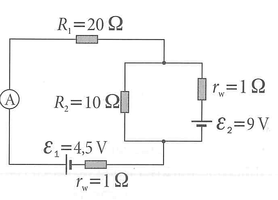

## 5. Kirchhoff's Laws

Using Kirchhoff’s laws, find the currents $I_1$, $I_2$, $I_3$ (going through the resistors $R_1$, $R_2$, $R_3$ respectively) in the following two-loop circuit:

- Left loop: ammeter $A$, top resistor $R_1 = 20\,\Omega$, and bottom source $\mathcal{E}_1 = 4.5\,\text{V}$ in series with internal resistance $r_w = 1\,\Omega$.
- Right loop: source $\mathcal{E}_2 = 9\,\text{V}$ in series with internal resistance $r_w = 1\,\Omega$.
- Shared branch: resistor $R_2 = 10\,\Omega$ connecting the top-right node to the bottom node.

---

### Terminology & Units

* **$I$ (Current)**: The flow of electrical charge, measured in **Amperes (A)**. We will solve for $I_1, I_2,$ and $I_3$.
* **$R$ (Resistance)**: The opposition to current flow provided by the main resistors, measured in **Ohms ($\Omega$)**.
* **$r_w$ (Internal Resistance)**: The small, inherent resistance inside the batteries themselves, also measured in **Ohms ($\Omega$)**.
* **$\mathcal{E}$ (Electromotive Force / EMF)**: The ideal voltage supplied by the power sources (batteries), measured in **Volts (V)**.

---

### Step 1: Circuit Setup & Assumptions

To apply Kirchhoff's laws, we first need to define the direction of current in each branch and the polarity of the batteries.

1. **Nodes:** Let's call the top junction "Node A" and the bottom junction "Node B".
2. **Current Directions:** * Let $I_1$ be the current flowing **upwards** through the left branch.
* Let $I_2$ be the current flowing **downwards** through the middle branch ($R_2$).
* Let $I_3$ be the current flowing **upwards** through the right branch. *(Note: The problem description mentions $R_3$, but since it doesn't exist in the diagram, we will solve for $I_3$ as the current through the entire right branch).*

3. **Battery Polarities:** In standard circuit diagrams, the longer parallel line represents the positive (+) terminal.
* For $\mathcal{E}_1$ (4.5 V): The longer line is on the left, so the positive terminal is on the left.
* For $\mathcal{E}_2$ (9 V): Visually, the top line is thicker, but in many textbook diagrams of this style, the longer/thinner line indicates the positive side. We will assume the **top** is the positive terminal. *(If your specific textbook uses the opposite convention, the math structure remains the same, just with a flipped sign for $\mathcal{E}_2$)*.

---

### Step 2: Applying Kirchhoff's Laws

**1. Kirchhoff's Current Law (KCL) at Node A (Top Node):**
The sum of currents entering a node equals the sum of currents leaving it.

* Currents entering: $I_1$ and $I_3$
* Current leaving: $I_2$

$$I_1 + I_3 = I_2 \quad \text{--- (Equation 1)}$$

**2. Kirchhoff's Voltage Law (KVL) - Left Loop:**
Let's trace the left loop **clockwise**, starting from Node B (bottom).

* Go left and up: Pass through $\mathcal{E}_1$ from negative to positive $\rightarrow$ **Gain of $4.5\text{ V}$**.
* Pass through internal resistance $r_{w1}$ with the current $\rightarrow$ **Drop of $-I_1 \times 1\ \Omega$**.
* Pass through $R_1$ with the current $\rightarrow$ **Drop of $-I_1 \times 20\ \Omega$**.
* Go down the middle branch: Pass through $R_2$ with the current $\rightarrow$ **Drop of $-I_2 \times 10\ \Omega$**.
* Summing these to zero gives:

$$4.5 - 1 I_1 - 20 I_1 - 10 I_2 = 0$$

$$21 I_1 + 10 I_2 = 4.5 \quad \text{--- (Equation 2)}$$

**3. Kirchhoff's Voltage Law (KVL) - Right Loop:**
Let's trace the right loop **counter-clockwise**, starting from Node B.

* Go right and up: Pass through $\mathcal{E}_2$ from negative to positive (assuming top is +) $\rightarrow$ **Gain of $9\text{ V}$**.
* Pass through internal resistance $r_{w2}$ with the current $\rightarrow$ **Drop of $-I_3 \times 1\ \Omega$**.
* Go left and down the middle branch: Pass through $R_2$ with the current $\rightarrow$ **Drop of $-I_2 \times 10\ \Omega$**.
* Summing these to zero gives:

$$9 - 1 I_3 - 10 I_2 = 0$$

$$I_3 + 10 I_2 = 9 \quad \text{--- (Equation 3)}$$

---

### Step 3: Solving the System of Equations

We now have a system of three equations. Let's substitute Equation 1 ($I_2 = I_1 + I_3$) into Equations 2 and 3.

**Substitute into Equation 2:**

$$21 I_1 + 10(I_1 + I_3) = 4.5$$

$$31 I_1 + 10 I_3 = 4.5 \quad \text{--- (Equation 4)}$$

**Substitute into Equation 3:**

$$I_3 + 10(I_1 + I_3) = 9$$

$$10 I_1 + 11 I_3 = 9$$

Rearrange to isolate $I_3$:

$$11 I_3 = 9 - 10 I_1 \implies I_3 = \frac{9 - 10 I_1}{11}$$

**Substitute this expression for $I_3$ back into Equation 4:**

$$31 I_1 + 10 \left( \frac{9 - 10 I_1}{11} \right) = 4.5$$

Multiply the entire equation by 11 to clear the denominator:

$$341 I_1 + 10(9 - 10 I_1) = 49.5$$

$$341 I_1 + 90 - 100 I_1 = 49.5$$

$$241 I_1 = 49.5 - 90$$

$$241 I_1 = -40.5$$

$$I_1 = -\frac{40.5}{241} \approx -0.168\text{ A}$$

*(The negative sign means the actual current flows downwards, opposite to our initial upward assumption).*

**Calculate $I_3$:**

$$I_3 = \frac{9 - 10(-0.168)}{11} = \frac{9 + 1.68}{11} = \frac{10.68}{11} \approx 0.971\text{ A}$$

**Calculate $I_2$:**

$$I_2 = I_1 + I_3 = -0.168 + 0.971 \approx 0.803\text{ A}$$

### Final Answers:

* **$I_1 \approx -0.17\text{ A}$** (flows counter-clockwise/downward in the left branch)
* **$I_2 \approx 0.80\text{ A}$** (flows downward in the middle branch)
* **$I_3 \approx 0.97\text{ A}$** (flows counter-clockwise/upward in the right branch)