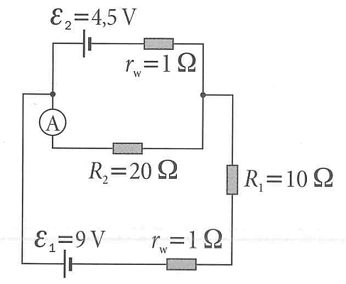

## 6. Kirchhoff's Laws again

Calculate the current flowing through the ammeter.

---

### **Variable Definitions & Units**

* **$\varepsilon_1, \varepsilon_2$ (Electromotive Force / EMF):** The voltage supplied by the batteries, measured in Volts ($\text{V}$).
* **$r_w$ (Internal Resistance):** The inherent resistance inside the batteries, measured in Ohms ($\Omega$). "w" likely stands for "wewnętrzna" (internal in Polish).
* **$R_1, R_2$ (External Resistance):** The resistance of the standard resistors in the circuit, measured in Ohms ($\Omega$).
* **A (Ammeter):** A device used to measure the electric current flowing through a specific branch. We assume it is an *ideal ammeter* with zero resistance.
* **$I$ (Current):** The flow of electric charge, measured in Amperes ($\text{A}$).
* **$V$ (Voltage):** Electric potential, measured in Volts ($\text{V}$).

---

### **Step-by-Step Solution**

**1. Circuit Topology Analysis**
The circuit consists of three parallel branches connecting two main junction nodes. Let's call the entire left wire **Node L** and the entire right wire **Node R**.

* **Top Branch:** Contains battery $\varepsilon_2$ and its internal resistor $r_w$.
* **Middle Branch:** Contains the ammeter and resistor $R_2$.
* **Bottom Branch:** Contains battery $\varepsilon_1$, its internal resistor $r_w$, and external resistor $R_1$ in series.

**2. Nodal Analysis Setup**
Let's assign an electric potential to each node. For simplicity, we can set the right node to ground, meaning $V_R = 0\text{ V}$. Let the voltage at the left node be $V_L = V$.

According to **Kirchhoff's Current Law (KCL)**, the sum of all currents leaving Node L must equal zero:

$$I_{\text{top}} + I_{\text{mid}} + I_{\text{bot}} = 0$$

**3. Expressing Branch Currents using Ohm's Law and KVL**
We need to write an expression for the current in each branch flowing from Node L to Node R. Note the battery symbols: the longer parallel line represents the positive terminal. Both batteries have their positive terminals facing Node L.

* **Top Branch:** Moving from L to R, the potential drops across the battery by $\varepsilon_2$.

$$I_{\text{top}} = \frac{V - \varepsilon_2}{r_w} = \frac{V - 4.5}{1}$$

* **Middle Branch:** 
$$I_{\text{mid}} = \frac{V - 0}{R_2} = \frac{V}{20}$$

* **Bottom Branch:** Moving from L to R, the potential drops across the battery by $\varepsilon_1$. The total resistance here is $r_w + R_1 = 1\text{ }\Omega + 10\text{ }\Omega = 11\text{ }\Omega$.

$$I_{\text{bot}} = \frac{V - \varepsilon_1}{r_w + R_1} = \frac{V - 9}{11}$$

**4. Solving for Node Voltage ($V$)**
Substitute the current expressions back into the KCL equation:

$$\frac{V - 4.5}{1} + \frac{V}{20} + \frac{V - 9}{11} = 0$$

Separate the terms containing $V$:

$$V - 4.5 + 0.05V + \frac{V}{11} - \frac{9}{11} = 0$$

$$V \left(1 + \frac{1}{20} + \frac{1}{11}\right) = 4.5 + \frac{9}{11}$$

Find a common denominator ($220$) to combine the fractions:

$$V \left(\frac{220}{220} + \frac{11}{220} + \frac{20}{220}\right) = \frac{4.5 \times 220}{220} + \frac{9 \times 20}{220}$$

$$V \left(\frac{251}{220}\right) = \frac{990}{220} + \frac{180}{220}$$

$$V \left(\frac{251}{220}\right) = \frac{1170}{220}$$

$$251V = 1170$$

$$V = \frac{1170}{251} \approx 4.661\text{ V}$$

**5. Calculating the Ammeter Current**
The ammeter is located in the middle branch, so it reads $I_{\text{mid}}$.

$$I_{\text{mid}} = \frac{V}{20} = \frac{4.661}{20} \approx 0.233\text{ A}$$

**Final Answer:**
The current flowing through the ammeter is approximately **$0.233\text{ A}$** (or $233\text{ mA}$).
